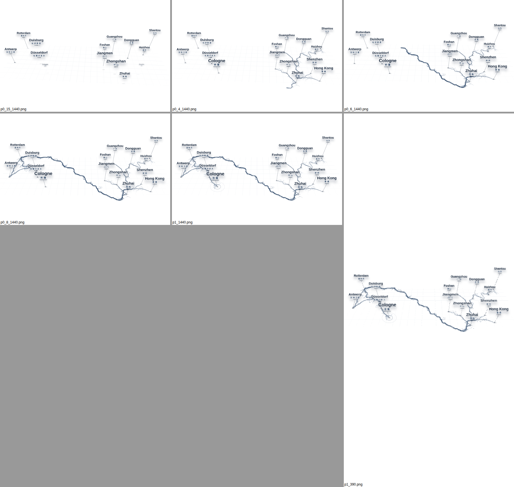
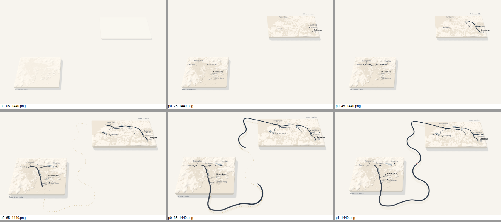

# River Scene – China ↔ Deutschland (aktuelle Variante)

**Lieferobjekt:** [`src/RiverScene.revyme.jsx`](src/RiverScene.revyme.jsx) = Revyme-Fassung (liegt im Revyme-Projekt als `components/RiverScene.tsx`), typisierte Quelle: [`src/RiverScene.tsx`](src/RiverScene.tsx).
Nachbau der Referenz (`river-scene.jsx`, Video): Städte ploppen auf → Adern im Perlfluss-Delta → Hauptader über das Meer → Rhein hinauf bis Köln → Idle (Wasser fließt).
Reines SVG + HTML, nur React. Modi: Scroll (eigene Höhe), Scroll (Eltern-Sektion), Autoplay. Hochformat: automatische Kamerafahrt China → Route → Rheinland → Gesamtbild.



Hinweis Revyme: Funktionen dürfen nicht `animate(`, `hover(` oder `press(` heißen – Revyme importiert sonst automatisch framer-motion (Namenskollision).

---

# River Bridge – 3D-Kartenanimation (PearlRhine Partners)

Revyme Code Component nach Spec v2: Perlflussdelta und Rheinkorridor als Reliefmodell-Kartenplatten,
Flussnetze als Adergeflecht, mäandrierende Verbindung (Kinoshita) von Mündung zu Mündung.

**Lieferobjekt:** [`src/RiverBridge.tsx`](src/RiverBridge.tsx) – eine Datei, Geo-Daten inline (~93 KB), nur `three` als Abhängigkeit.



## Einbau in Revyme

1. Im Revyme-Projekt eine neue Code Component anlegen und den Inhalt von `src/RiverBridge.tsx` vollständig einfügen.
2. `three` als Projektabhängigkeit sicherstellen (Next.js-Export: `npm i three`). Keine CDN-Ladevorgänge, alles wird mitgebündelt.
3. Komponente auf der Seite platzieren, Seitenhintergrund Ivory `#F7F4EE` (Canvas ist transparent).
4. Modus wählen:
   - **Scroll (Default, Modus A):** Komponente setzt ihre Höhe selbst (`scrollLength` vh) und pinnt die Bühne per `position: sticky`. Kein Vorfahr darf `overflow: hidden` haben.
   - **Scroll (Eltern-Sektion, Modus B):** Komponente füllt ihre Box; Fortschritt aus dem Eltern-Element (`scrollParentDepth` Ebenen nach oben). Sektion mit Höhe + Sticky nativ in Revyme anlegen.
   - **Autoplay (Modus C):** startet bei 40 % Sichtbarkeit, `autoplayDuration` Sekunden, danach Idle-Fluss.
5. Im Editor zeigt die Komponente statisch den Frame `previewProgress` (Default 1 = Endzustand).

Prüfpunkte 1–3 (three-Auflösung, Eigenhöhe, Revyme-MCP) sind im Kopf von `RiverBridge.tsx` dokumentiert.

## Controls

Alle Controls aus Spec Abschnitt 9 (JSDoc `@controls`), zusätzlich `scrollParentDepth` für Modus B.

## Entwicklung

```bash
npm install
npm run dev                         # Prototyp: http://127.0.0.1:5173/  (Scroll-Testseite)
#   ?p=0.5&static=1                 # fester Frame wie im Editor, Debug-Slider unten rechts
#   ?mode=autoplay  ?locale=de|zh   # beliebige Props per Query
npm run typecheck
node scripts/fetch-geo.mjs          # Rohdaten laden (Natural Earth, OSM, Terrain Tiles) → scripts/.cache
npm run build:geo                   # Geo-Build → bettet Daten in src/RiverBridge.tsx ein + Vorschau-SVGs
node scripts/screenshots.mjs        # Screenshots p = 0.05 … 1.0 auf 1440 / 390 px
node scripts/check-modes.mjs        # Scroll vor/zurück, Autoplay, Reduced Motion, kein WebGL, Editor
```

## Datenquellen & Lizenzen

- Küste/Land: © OpenStreetMap-Mitwirkende (ODbL), osmdata.openstreetmap.de simplified land polygons
- Flussnetz & Nebengewässer: © OpenStreetMap-Mitwirkende (ODbL), Overpass API
- Stadtflächen, Seen: Natural Earth 1:10m (gemeinfrei)
- Relief: Mapzen/AWS Terrain Tiles (Terrarium, z9)

OSM-Attribution muss auf der Website genannt werden (z. B. Impressum/Footer: „Kartendaten © OpenStreetMap-Mitwirkende“).

## Umsetzungsnotizen / Abweichungen

- **Tone Mapping:** Statt ACESFilmic lineare Ausgabe mit kalibriertem Licht (Hemisphere : Key = 0.9 : 1.4). ACES staucht Card und Sand auf fast identische Werte; so zeigen ebene Flächen exakt die Tokenfarben, Hänge schummern.
- **Relief-Überhöhung:** `reliefScale` 0.18 ≙ 0.27 Welt-Einheiten je 1000 m.
- **Mäander:** Kinoshita-Kurve auf einer Leitkurve Mündung → um die China-Platte → Lücke zwischen den Platten → westlich der Rhein-Platte → Rhein-Mündung. Querauslenkung lokal durch den Abstand zu den Platten begrenzt; `meanderBends` Schleifen im mittleren Abschnitt, gleiche Frequenz mit 30 % Amplitude zu den Mündungen.
- **Mobil (< 640 px):** zusätzlich Kamera-Neigung +12° und 30 % mehr Plattenabstand, damit die Hochformat-Fläche genutzt wird.
- **Shenzhen-/Hongkong-Kapillaren, Schelde:** kein durchgehendes OSM-Gewässer → Handkoordinaten + Perlin-Versatz (Spec 5.4).
- **Budget:** Geo-Daten 93 KB (≤ 120 KB); Komponente + three ≈ 213 KB gzip (≤ 220 KB, React nicht mitgezählt). Draw Calls ≈ 11.
- **China-Hinweis:** keine Verwaltungsgrenzen. Finalen Kartenausschnitt vom Shenzhen-Partner gegenprüfen lassen (Spec 8).
